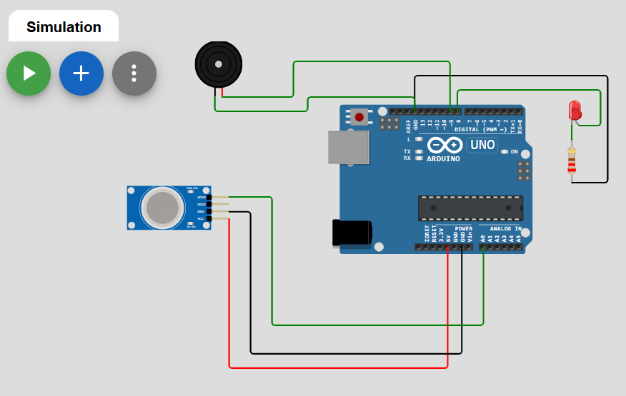
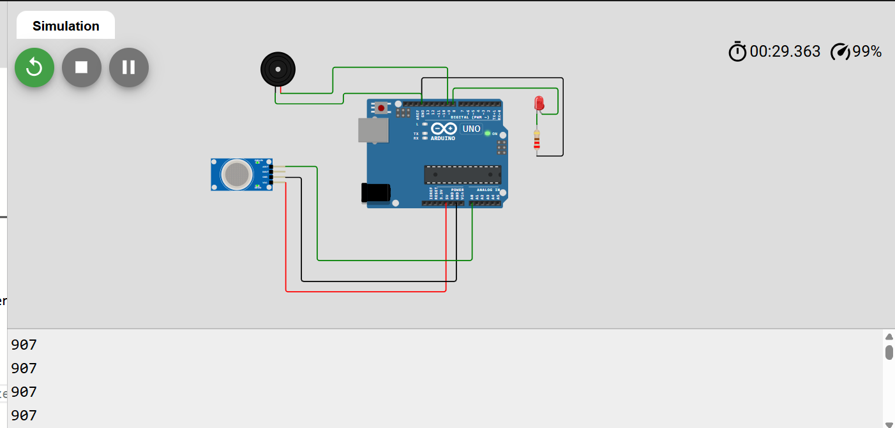
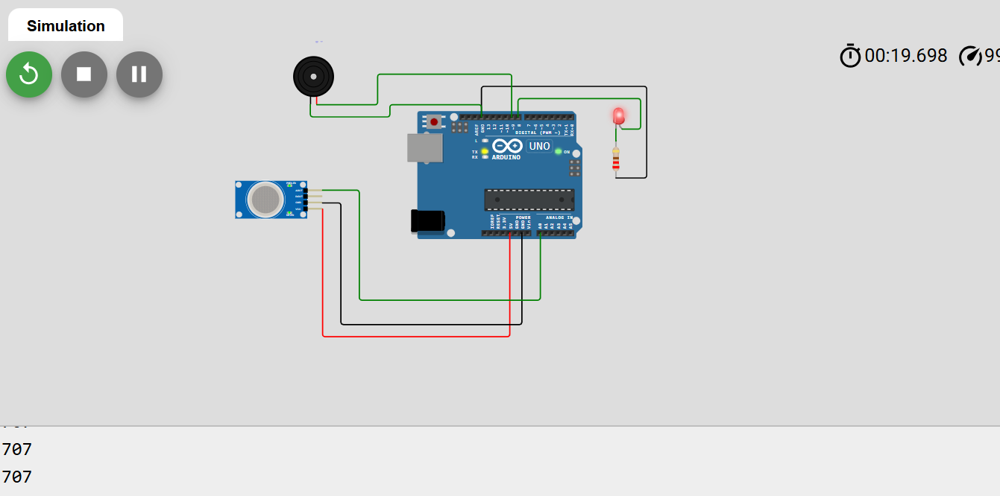

# Industrial Gas Leakage Detection System

This project detects harmful gas leakage using an MQ2 gas sensor and Arduino UNO. 
When gas concentration increases, the system activates an LED and buzzer alarm.

---

## Components Used

1. Arduino UNO
2. MQ2 Gas Sensor
3. LED
4. Buzzer
5. Resistor
6. Jumper wires

---

## Circuit Diagram

## Working Principle

1. MQ2 sensor detects gas concentration.
2. Sensor sends analog signal to Arduino A0.
3. Arduino reads the gas value.
4. If gas value is greater than threshold:
   - LED turns ON
   - Buzzer sounds alarm
5. If gas level is normal:
   - LED OFF
   - Buzzer OFF
  
   - ## Simulation

## Gas Detection Alert

## Arduino Code

int gasSensor = A0;
int led = 8;
int buzzer = 9;

void setup() {
  pinMode(led, OUTPUT);
  pinMode(buzzer, OUTPUT);
  Serial.begin(9600);
}

void loop() {

  int gasValue = analogRead(gasSensor);
  Serial.println(gasValue);

  if (gasValue > 400) {
    digitalWrite(led, HIGH);
    tone(buzzer, 1500);   // buzzer sound
  }
  else {
    digitalWrite(led, LOW);
    noTone(buzzer);       // buzzer off
  }

  delay(200);
}

## Applications

• Industrial gas leakage monitoring  
• Chemical plant safety  
• Steel plants  
• Home gas safety systems

## Online Simulation

Run the project online:

[Open Wokwi Simulation](https://wokwi.com/projects/457587883476598785)

